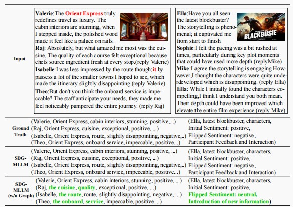

# SDG-MLLM: Injecting Structured Dialogue Graphs into MLLM for
Multimodal Conversational Aspect-Based Sentiment Analysis

Codes for SDG-MLLM: Injecting Structured Dialogue Graphs into MLLM for
Multimodal Conversational Aspect-Based Sentiment Analysis (ACM MM 2025)

## Model Structure

## Results

